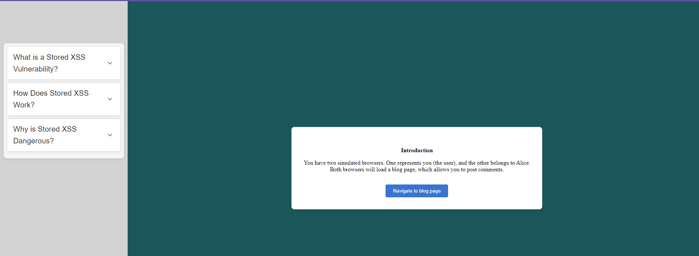
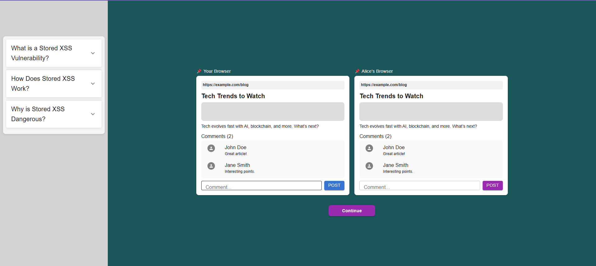
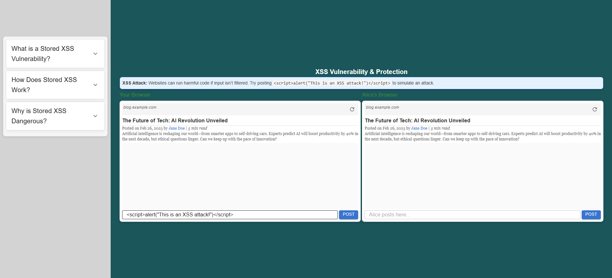
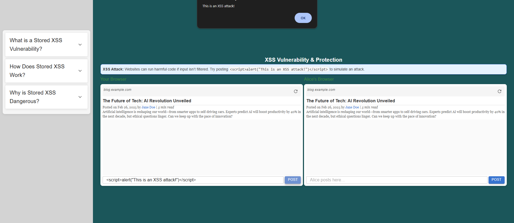
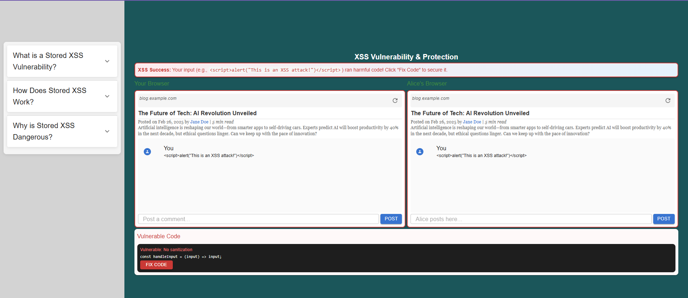
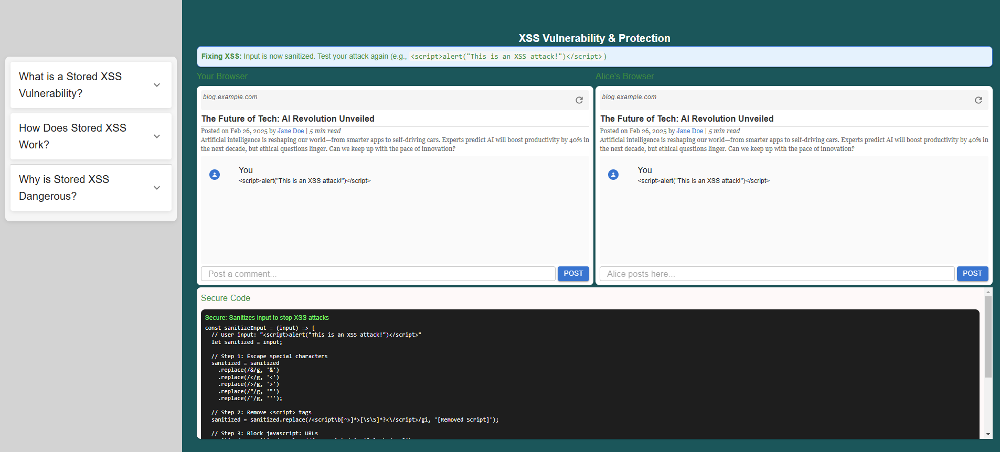
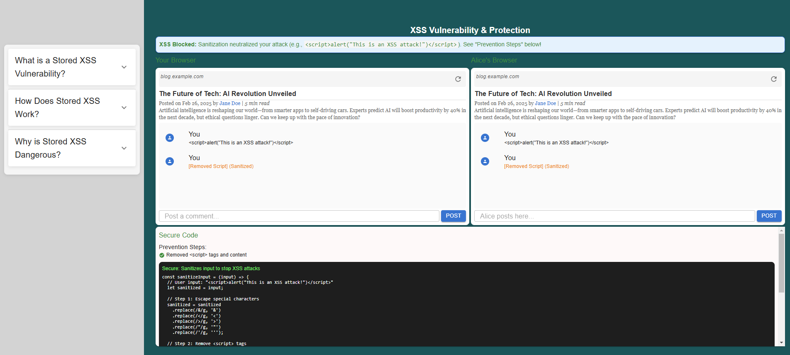

<b>Simulation Introduction</b>
  
 <li> You have two simulated browsers. One represents you (the user), and the other belongs to Alice.</li>
   <li> Both browsers will load a blog page, which allows you to post comments.</li>

 
<b>Loading the Blog</b>
<li>navigate to the blog page</li>
<li>Observe the comments section where you can post your comments.</li>
 

<b>Introducing an XSS Payload</b>
<li>In your browser, type the following comment:
  
     

   - Submit the comment.
</li>
 

<b>Triggering the Alert</b>
<li>In your browser, observe that as soon as you submit the comment, an alert with the message  pops up.
</li>
 

<b> Storing the Payload</b>
<li> When you inject the XSS script, the application becomes vulnerable, allowing the malicious code to execute. Observe the code section where user input is not sanitized, leading to the vulnerability not being handled properly.</li>
   
 
<li>Click the "Fix Code" button to correct the vulnerability by properly adding sanitization to the input field. Observe the changes in the code and how it prevents the XSS attack.</li>
 

<b>Step 6 - Preventing Stored XSS</b>

To prevent stored XSS vulnerabilities, 

<li> Implement input validation and sanitization on the server-side to filter out or escape potentially malicious content.</li>
<li>Now, try entering the XSS script again and observe how input sanitization prevents the attack, ensuring the script is no longer executed.</li>
 

